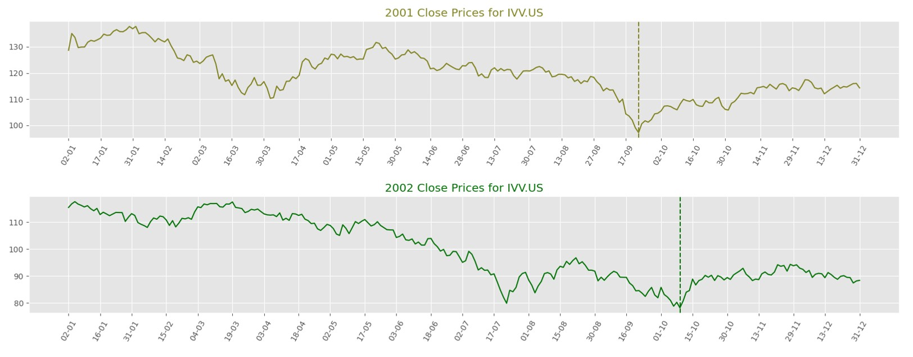
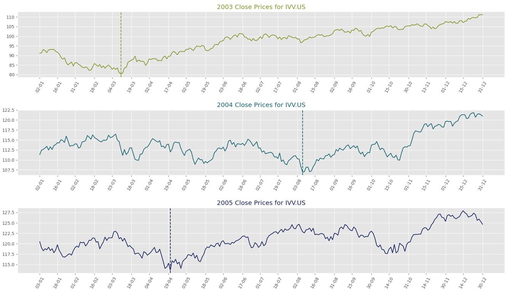
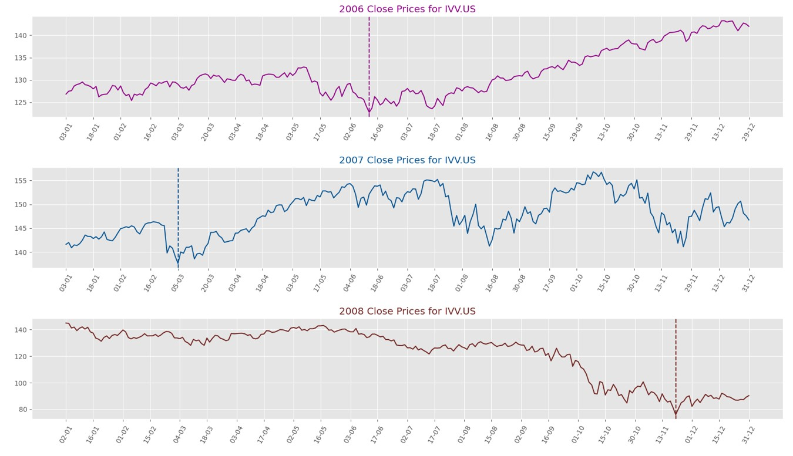
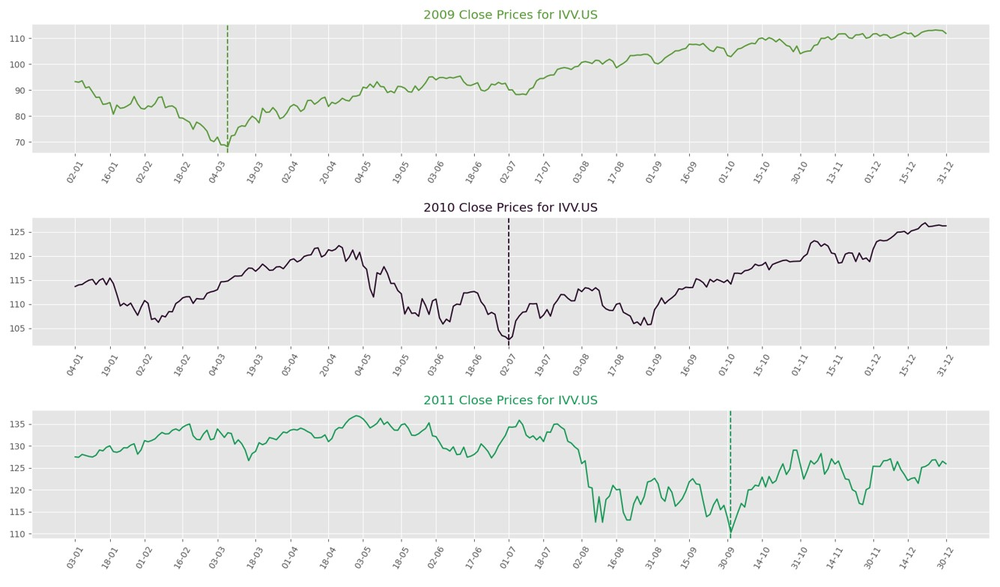
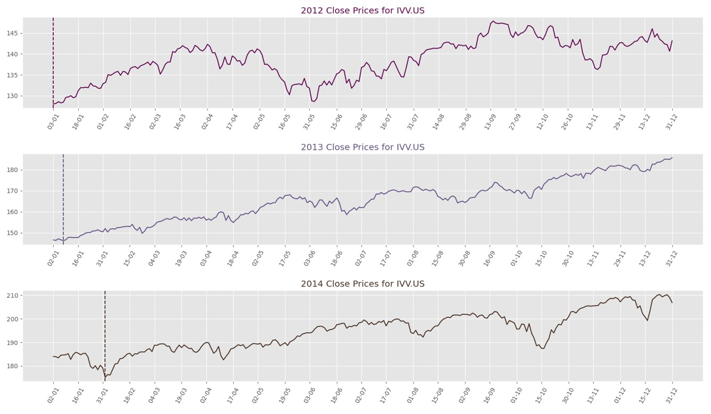
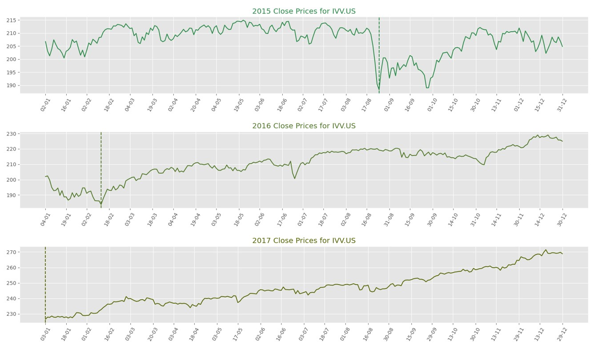
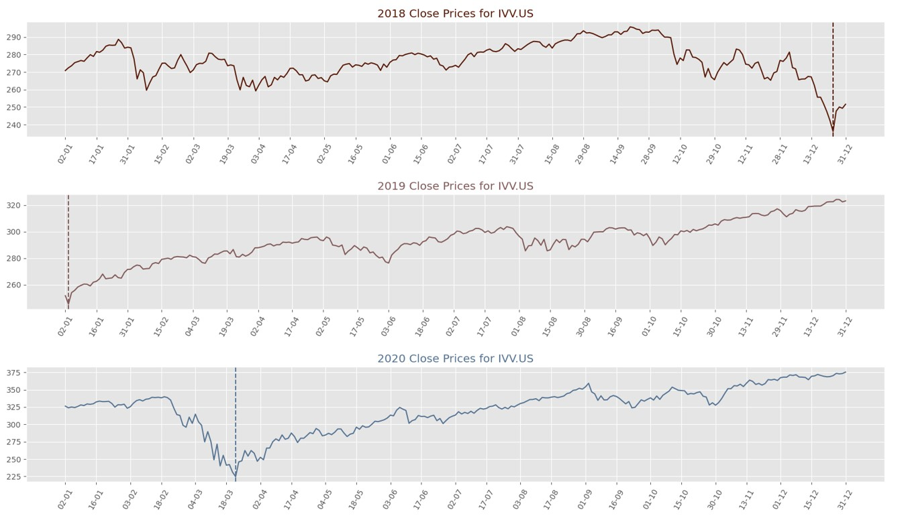
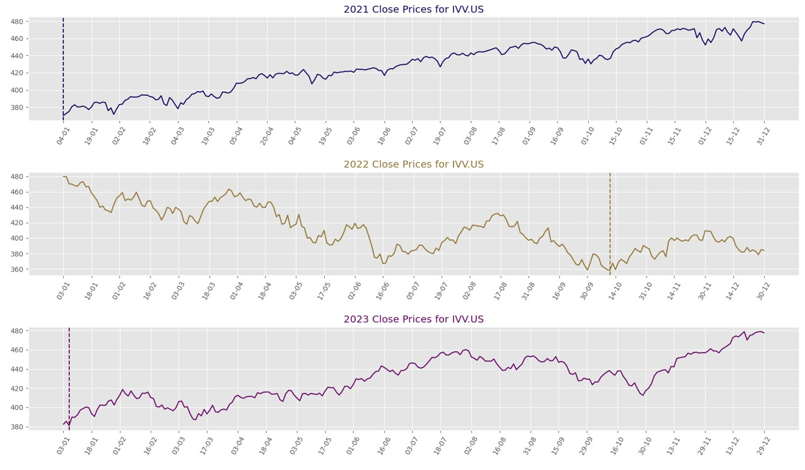

I present to you a comprehensive Time Series Analysis of the historical prices of the iShares Core S&P 500 ETF, identified by the stock ticker IVV.US, spanning an extensive period of 24 years since the year 2000. Should you wish to delve into this project, kindly refer to the link [GitHub](https://github.com/K-Z007/time-series-analysis).

``` py
import random

$ df = pd.read_csv(r".\financial_data\IVV_US.csv")
......

plt.style.use("ggplot")
num_labels = 25  # Adjust this value to control the number of labels
num_of_years = np.unique(newDf.index.year)

fig, ax=plt.subplots(len(num_of_years), 1, figsize=(20, 100))

for i in range(0, len(num_of_years)):
    year = str(num_of_years[i])
    x_axis= np.arange(len(newDf.loc[year].index))
    label_indices = np.linspace(0, len(x_axis)-1, num_labels, dtype=int)
    
    random_color = "#" + ''.join([random.choice('0123456789') for _ in range(6)])
    ax[i].plot(newDf.loc[year].index.strftime('%m-%d'), newDf.loc[year].Close, color=random_color, label= year)

    # Find the lowest point
    min_close = newDf.loc[year].Close.min()
    min_date = newDf.loc[year][newDf.loc[year].Close == min_close].index.strftime('%m-%d')[0]

    # Add a vertical line at the lowest point
    ax[i].axvline(x=min_date, color=random_color, linestyle='--')
    ax[i].set_xticks(x_axis[label_indices])
    ax[i].set_xticklabels([newDf.loc[year].index.strftime('%d-%m')[i] for i in label_indices], rotation=60)
    ax[i].set_title(year + ' Close Prices for IVV.US', color=random_color)  # Add subtitle for the first chart

plt.subplots_adjust(hspace=0.5)  # Increase the spacing between the subplots
#plt.savefig('my_plot.png')
plt.show()
```


<!-- more -->







