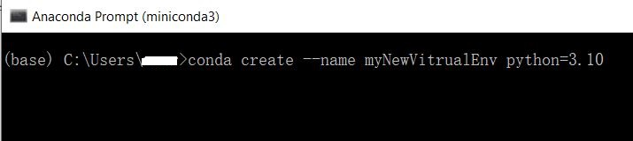
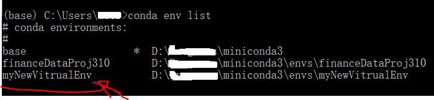
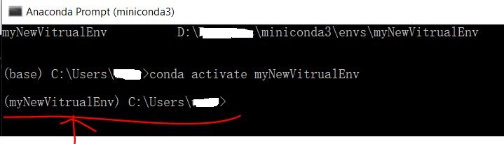
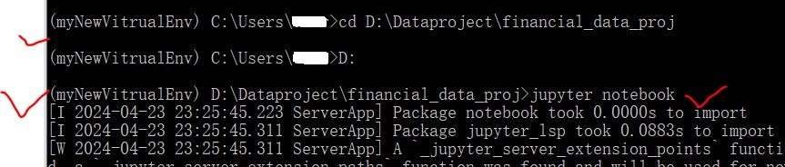

This post covers miniconda, including its installation and managing conda virtual environments. After using the Anaconda suite for quite some time, I found it cumbersome, with many unused tools, a large number of default packages, and a substantial volume size. Consequently, I decided to uninstall Anaconda and switch to the more lightweight miniconda distribution.

For miniconda installation link:  [miniconda](https://docs.anaconda.com/free/miniconda/miniconda-install/).

<h3>Creating and Managing Virtual Environment</h3>


<span class="large-text">1. Open Anaconda Terminal</span>
<span class="large-text">2. Create new virtual environment and install specific python verison
into this virtual environment</span>



<span class="large-text">3. Typing "conda env list" to check the virtual environments just created</span>


<!-- more -->
<span class="large-text">4. Switch or Activate the virtual environment just create</span>

``` py
>> conda activate myNewVitrualEnv
```

Then you will see the front in () changed to your just created virtual environment name



<span class="large-text">5. Then install the package you needed to work in the project</span>

``` py
>> conda install jupyter pandas numpy
```

<span class="large-text">6. Then cd into any folder you want project to be placed at To launch Jupyter Notebook</span>

``` py
>> (myNewVitrualEnv) D:\Dataproject\financial_data_proj>jupyter notebook
```



<span class="large-text">7. To remove a virtual environment:</span>

``` py
>> (base) conda remove --name myNewVitrualEnv --all
```